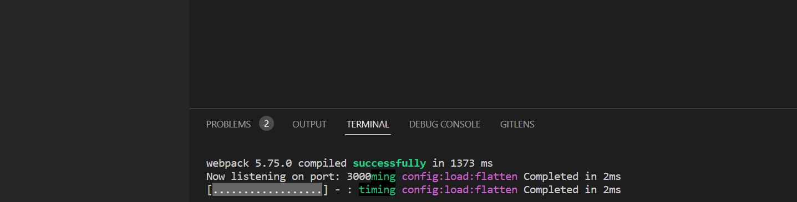
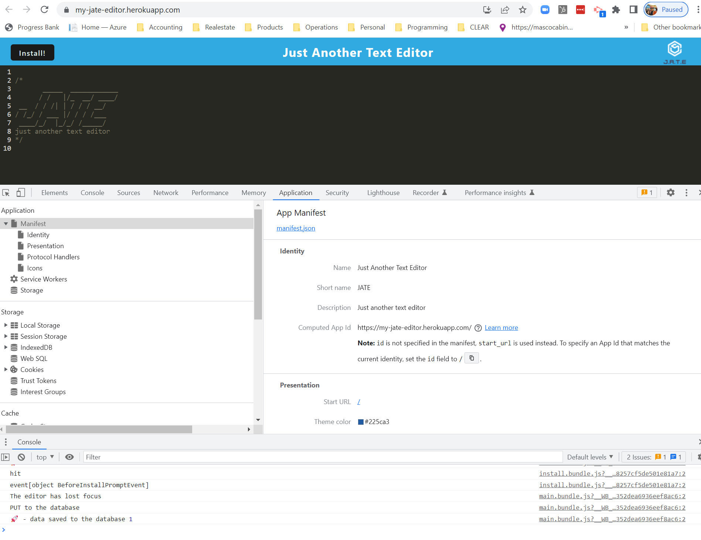

# Progressive Web Application

## Description
The application is a web text editor where you can take notes, enter code snippets and then retrieve them with or without the internet.

The URL is https://my-jate-editor.herokuapp.com/

## Table of Contents

* [Installation](#installation)
* [Usage](#usage)
* [Technologies](#technologies)
* [License](#license)
* [Questions](#questions)
* [Author](#author)

## Installation

* This application will require the installation of Node.js and various npm packages.

*   Run - npm init
*   Run - npm install
*   Run - npm run build
*   Run - npm run start
* The required modules are bundled in the package.json file and at CLI or integrated terminal type in **npm run install**, the modules will be installed.       

## Usage

1.
``````    
WHEN I open my application in my editor
THEN I should see a client server folder structure
``````
*Below is the screenshot of the client server folder structure.  The folder structure have been set up or given in this structure.*


2.
``````
WHEN I run `npm run start` from the root directory
THEN I find that my application should start up the backend and serve the client
``````
*Below is the screenshot of server running*



3.
``````
WHEN I run the text editor application from my terminal
THEN I find that my JavaScript files have been bundled using webpack
``````
*Below is the screenshot of the generated HTML, service worker and a manifest file*


4.
``````
WHEN I run my webpack plugins
THEN I find that I have a generated HTML file, service worker, and a manifest file
``````
*Below is the screenshot of the application information*



5.
``````
WHEN I use next-gen JavaScript in my application
THEN I find that the text editor still functions in the browser without errors
``````
*Below is the  screenshot of content in the text editor has been retrieved from the IndexedDB"*


6.
``````
WHEN I open the text editor
THEN I find that IndexedDB has immediately created a database storage
``````
*Below is the screenshot data storage*


7.
``````
WHEN I enter content and subsequently click off of the DOM window
THEN I find that the content in the text editor has been saved with IndexedDB
``````
*Below is the screenshot of the data saved on lost focus*


8.
``````
WHEN I reopen the text editor after closing it
THEN I find that the content in the text editor has been retrieved from our IndexedDB
``````
*Below is the screenshot of the app on reopen*


9.
``````
WHEN I click on the Install button
THEN I download my web application as an icon on my desktop
``````
*Below is the screenshot of the desktop icon*


10.
 ``````
WHEN I load my web application
THEN I should have a registered service worker using workbox
``````
*Below is the screenshot of the service worker*


11.
``````
WHEN I register a service worker
THEN I should have my static assets pre cached upon loading along with subsequent pages and static assets
``````
*Below is the screenshot of the Cached Storage*


11.
``````
WHEN I deploy to Heroku
THEN I should have proper build scripts for a webpack application 
``````
*Below is the screenshot of Heroku info*


## Technologies
* JavaScript
* Webpack
* Express.js
* Heroku

## License


This application is covered by the Open license. 

## Author
Chris Holtz
Email choltz@cacbydesign.com to suggest an edit.

## Questions

* Chris Holtz
* ✉️ Email: choltz@cacbydesign.com
* GitHub Username: choltz@cacbydesign.com
* GitHub Profile: https://clearbusinessinsight.github.io/jate-text-editor/


 
